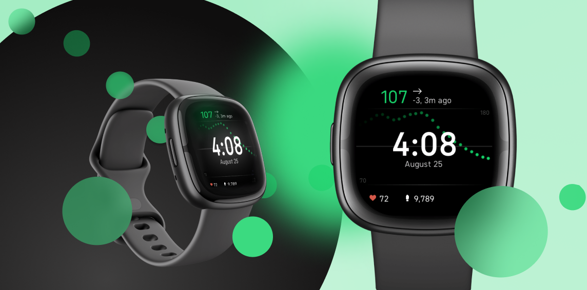

# PEAK

Peak is a largely superficial fork of [Glance](https://github.com/Rytiggy/Glance) by [Rytiggy](https://github.com/Rytiggy/Glance), and takes the form of a Fitbit clock face specializing in blood glucose monitoring. Take a peek at your peak (or, hopefully, a boring and level graph)!

<!-- <a  style="text-align: center;"  href="https://glancewatchface.com#setup">Click here to learn how to set up Glance!</a>   -->

<!-- ## Donation -->

<!-- I developed Glance to help people with diabetes! 50% of all donations will go to the <a target="_blank" href="https://www.faustmanlab.org/">Faustman lab</a>. The remaining 50% will be dedicated to future research and development of Glance.

 -->

## Features

###### Note: While the original [Glance](https://github.com/Rytiggy/Glance) works on a variety of Fitbit devices in and with various medical hardware, Peak has currently only been tested on a Fitbit Sense & Versa 3 with Dexcom, and the below features, while technically present, likely need some adjustments

### ✅ &nbsp; Tested & Working 

- 💯&nbsp; Current BG (Mmol/L & Mg/dL)
- ↗️ &nbsp;Trend direction
- 🔺&nbsp; Delta
- ⏳&nbsp; Time since last pull
- 📈&nbsp; Graph of BG's over time
- 👣&nbsp; Step count
- 💗&nbsp; Heart rate
- ⌚&nbsp; Time
- 📅&nbsp; Date (and formatting options)
- 🪫&nbsp; Battery levels
- 📳&nbsp; Vibration Alerts
- 🎨&nbsp; Changing background color

### 🤷 &nbsp; Untested

- Insulin on Board (IOB)
- Carbs on Board (COB)
- Error reporting
- Temperature

## [User Agreement](https://github.com/mykol64/Peak/wiki/User-Agreement)

Peak must not be used to make medical decisions, by using Peak you agree to the [user agreement](https://github.com/mykol64/Peak/wiki/User-Agreement).